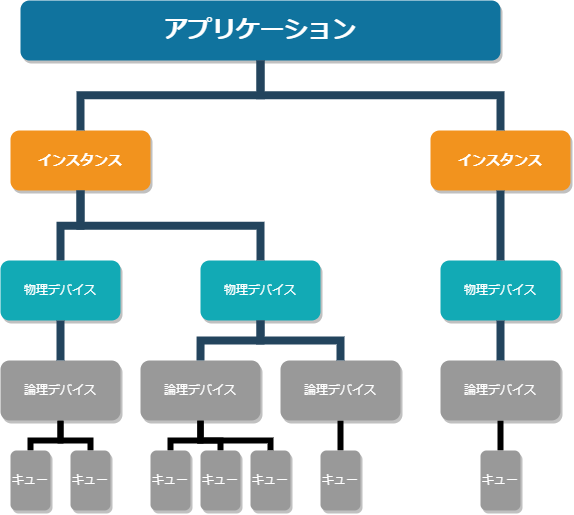

+++
title = "Vulkan プログラミングガイド"
date = "2023/01/04"
[extra]
category = "book"
published_at = "2022/06/25"
original_published_at = "2016/10/31"
tags = ["Vulkan", "Graphics"]
+++

Vulkan プログラミングガイドを読んだメモ  
原題: Vulkan Programming Guide: The Official Guide to Learning Vulkan (OpenGL) 

---

## この本について
Vulkanの解説です。 
同期、スケジューリング、メモリー管理などはVulkan以外にも適用できる一般的なトピックだがこの本のかなりの部分が底に当てられている。

#### 対象読者
ぅCDに補kzのグラフィックスとコンピュートAPIに精通した経験のあるプログラマー。  
コードサンプルは入力可能な完全なプログラムではない。公開されているサンプルコードは実行可能(完全なテスト済み)。  

Vulkanは単純なテストアプリケーションには不向き。  
グラフィックスの概念を教えるのにも向いていない。  

Vulkanは大きく、複雑で新しいシステム。
この範囲の1冊の本でAPIを隅々まで網羅するのは極めて困難。
読者はこの本だけでなくVulkanの使用wy尾を熟読し他のAPIでヘテロジニアスコンピュートシステムとグラフィックスの使用に関する本を読むことを推奨。

### サンプルコード
[vulkanprogrammingguide.com](https://www.vulkanprogrammingguide.com)で公開されているらしい。→されてなかった。  
本とは違う内容の[最新のサンプル(github)](https://github.com/KhronosGroup/Vulkan-Samples)。  

# 第1章 Vulkanの概要
Vulkanは明示的なAPI。OpenGLがやってくれたようなステートkの管理やメモリーとの同期やエラーチェックはすべて自分でやる必要がある。  
OpenGLの方法は素晴らしいが完全にデバッグ済みであればCPUの時間を無駄にする。 

Vulkanは非常に饒舌、同時にいくらか脆弱。使い方を誤ると以前のAPIなら有用なエラーメッセージを受け取る場所でクラッシュが起きたりする。  
引き換えにデバイスに対する多くの制御と、スッキリしたスレッド処理モデル、従来より遥かに高い性能を提供する。

VulkanはグラフィックスAPIにとどまらないものとして設計された。  
描画のAPI(**プレゼンテーション**)もコアAPIではなく**拡張機能**として提供される。  

## インスタンス、デバイス、キュー
  

### Vulkanインスタンス
VulkanはOpenGLのようにグローバルなステートを導入しないのでアプリケーションが供給するオブジェクトに格納する必要がある。  
これがインスタンスオブジェクト。  
```c
vkResult vkCreateInstance(const VkInstanceCreateInfo*  pCreateInfo,
                          const VkAllocationCallbacks* pAllocator,
                          VkInstance*                  pInstance);
```
で作成できる

### Vulkan 物理デバイス
```c
vkEnumeratePhysicalDevices(VkInstance instance, uint32_t* pPhysicalDeviceCount, VkPhysicalDevice* pPhysicalDevices)
```
`pPhysicalDevices`に`nullptr`を渡すとpPhysicalDeviceCountに物理デバイスの数が入る。  
その後`pPhysicalDevices`に有効な値を入れてもう一度呼び出すことで物理デバイスの取得ができる。
[サンプル内のコード](https://github.com/KhronosGroup/Vulkan-Samples/blob/9198f24ddd3dab9dd131d525c54689b6ab6da835/framework/core/instance.cpp#L424-L444)

### 物理デバイス メモリー

### デバイス キュー